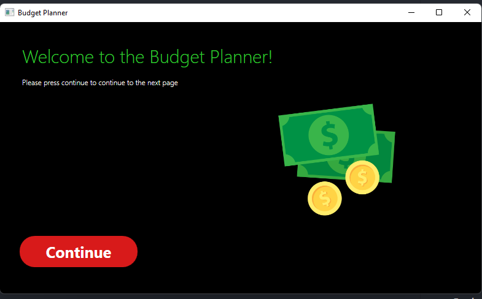
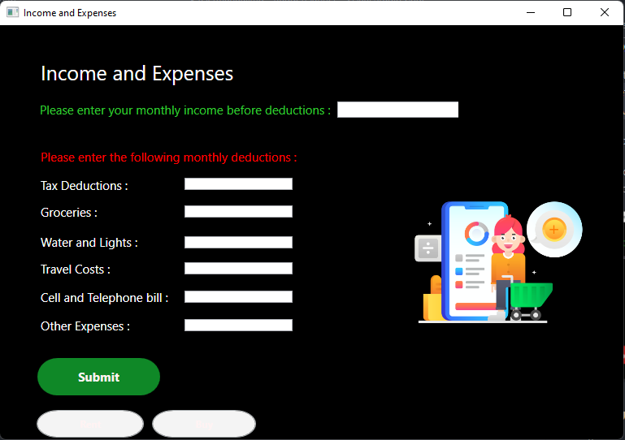
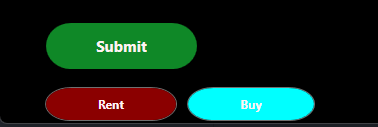
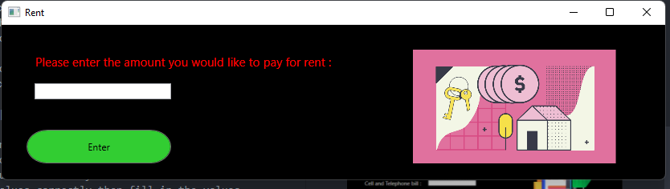
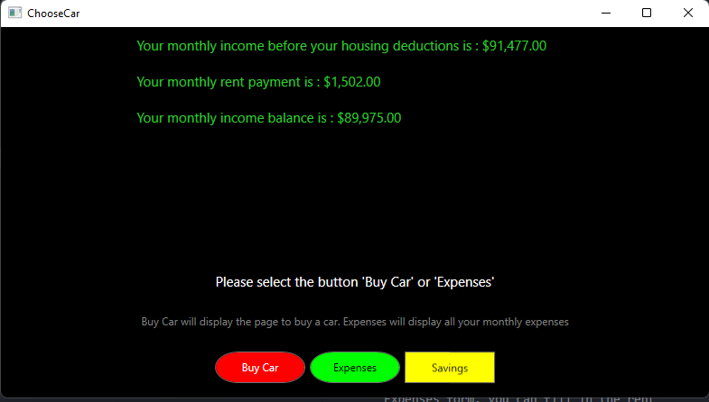
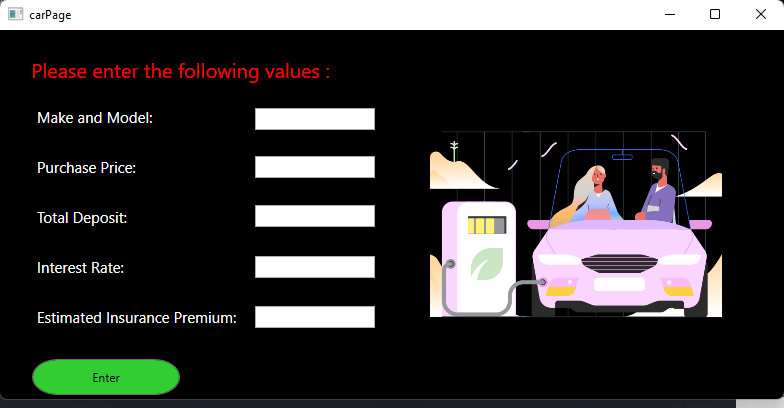
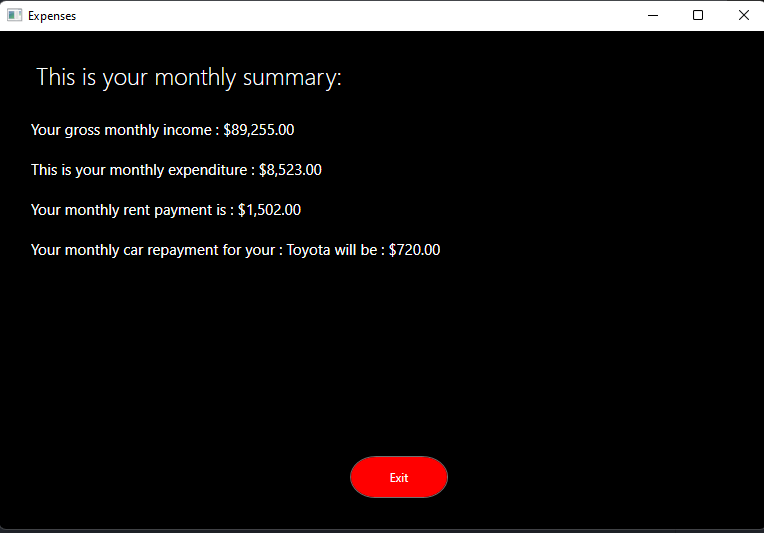
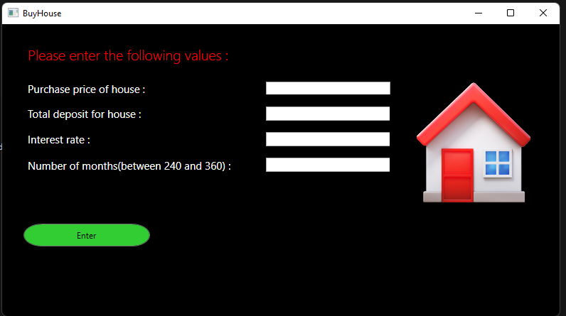
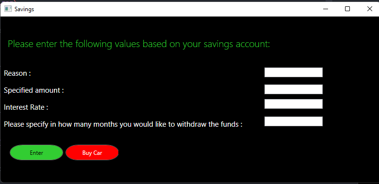
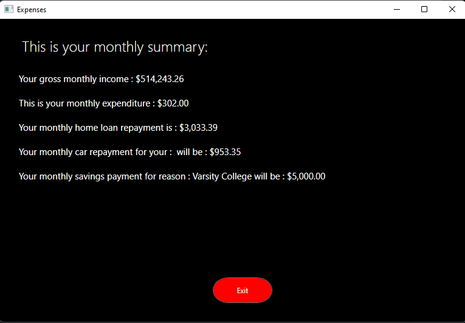

# Budget App - ST10084532
#### User Manual

### Introduction
The word budget comes from the Old French word bougette meaning "small leather purse", which in turn is a diminutive of the Gaulish bouge for "leather pouch, purse". Its first use in our contemporary understanding of a financial plan comes from the pamphlet The Budget Opened by William Pulteney, which uses the term budget to describe and critique the governments' fiscal policy on wine and tobacco.

The common usage of the word "budget" refers to a financial plan by an individual or an organization based on their projected income and expenses. By extension, it also is used in the sense of the amount that individual or organization has available to spend.

This application is a simple budgeting application that allows the user to create a budget, add expenses, and track the amount of money they have left to spend. It helps to save money and also helps you to plan to acquire more assets.

### Getting Started

#### Running Application
Navigate to `BudgetPlanner\BudgetPlanner\BudgetPlanner3.1\bin\Debug\netcoreapp3.1\`

then open `BudgetPlanner.exe`

Once you see this screen here below then you are good to go.

#### Adding Income and Expenses
It is important to add income and expenses to the application. Without this, the application will not be able to proceed to the next steps.

You can start by adding an income and expenses by filling in the app form.

Once you finished fill in all the values correctly, you can click on the `Submit` button else if you failed to fill in the values correctly then fill in the values @ the `red` textboxes

If you have successfully added income and expenses the other following buttons will unlock below.

#### Rent Expenses
You can add rent expenses by clicking on the `Rent` button. From the Income and Expenses form, you can fill in the rent expenses.

Once you submitted that you will get an overview of the rent expenses.

#### Purchasing Car
You can add purchasing car expenses by clicking on the `Car` button.

Just make sure you fill each thing in!

#### Viewing Summary Of Expenses

You can view the summary by concluding all the expenses in the application. This is the last form in the application

#### Taking a loan for home
You can take a loan for your home by clicking on the `Buy` button.

Just fill in the details as mentioned above.

Once again you will be @ the `overview` screen. you can choose to `Buy a Car`,`Calculate Savings`

#### Calculating Savings

From the `overview` screen, you can calculate the savings by clicking on the `Calculate Savings` button.

Fill the form in!

When you submit you come to the end of the application.

